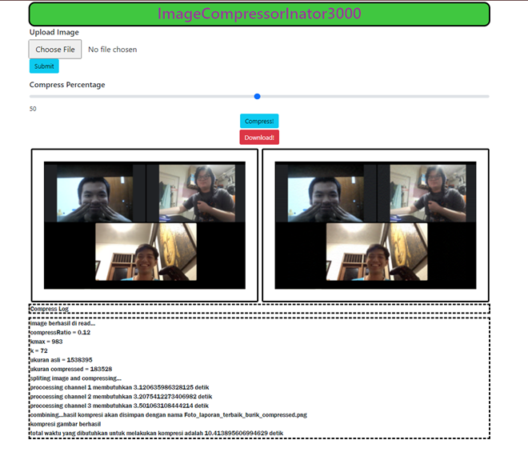

# Algeo02-20015 (ImageCompressorinator3000)

Tugas Besar 2 Mata Kuliah Aljabar Linear dan Geometri\
Mengkompres gambar menggunakan algoritma SVD

# Member
* Jaya Mangalo Soegeng Rahardjo 13520015
* Christopher Jeffrey 13520055
* Aldwin Hardi Swastia 13520167

## Tampilan Web

## Struktur Projek 
* **_doc_**  berisi laporan
* **_src_**  berisi file "source file" 
* **_test_** berisi gambar masukan

## Pre-requisite
* python
* flask
* flask-util
* opencv
* opencv-contrib
 (cek list_package.txt untuk lebih lengkap)

## Cara Run Program
1. Masuk ke folder **_src_**
2. Buka CMD
3. Ketik "python app.py"
4. Ketikkan "localhost:5000" di browser 
_(jangan buka dari IP di terminal, terdapat kemungkinan bug cache)_
